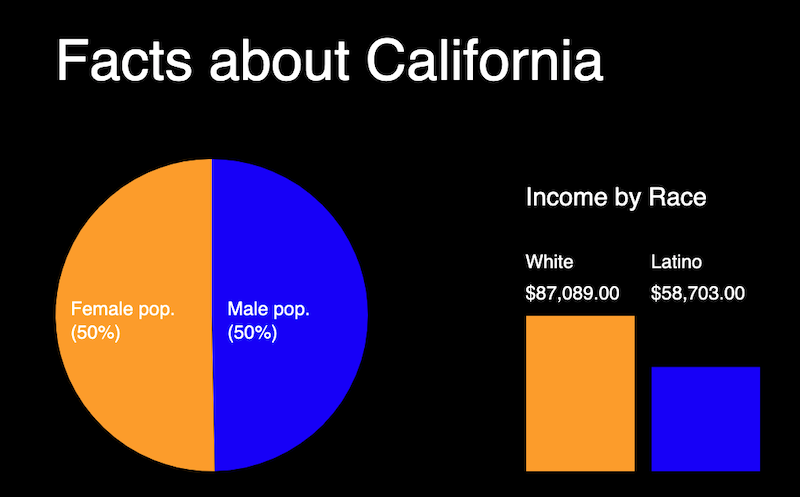
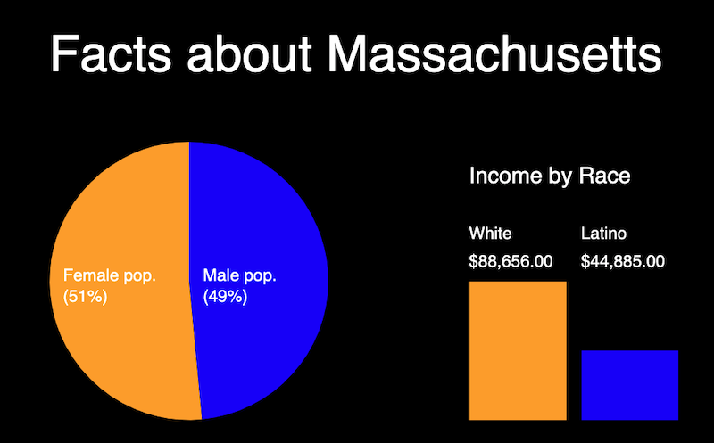

# PE-17.5 - Adding a Pie Chart and Bar Graph

## Mission
1) Using PE-17 as a starting point, replace the map visualization with a pie chart (showing population) and a bar graph (showing the income properties you chose)

2) `readStates()` will still create an array of the 50+ states

3) After creating the array of states, `readStates()` will now call `updateViz()` with a single state
  - example: `updateViz(stateArray[1]); // pass over California`

4) `updateViz()` will now accept a `State` object as a parameter, and will then create a visualization using that state's data. Example:

```js
function updateViz(state){
  console.log(state);
  // draw state name
  fill(255);
  textSize(36);
  let stateName = state.name;
  text("Facts about " + stateName,150,100);
  // now draw pie chart
  
  // now draw bar graph
```

5) Changing the `State` that is passed into `updateViz()` will change the visualization appropriately. It must display:

    - The state's name
    - The state's male & female population in a pie chart
    - The state's income (the 2 categories you chose) as a bar graph


<hr>

- **`updateViz(stateArray[1])`**



<hr>

- **`updateViz(stateArray[14])`**



<hr>
