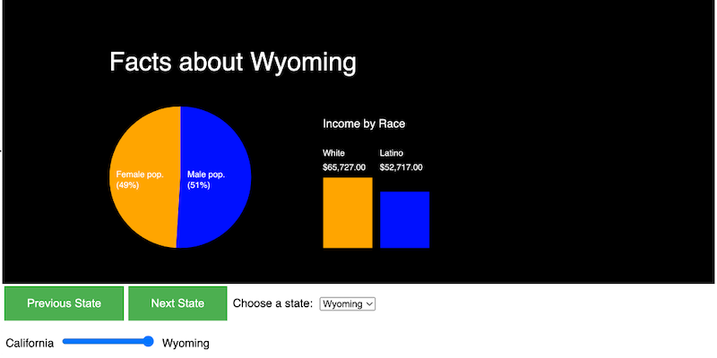

# PE-18 - Adding controls to your Data Viz


## Overview
- Once again, we will be visualizing a little of the output of data from an external JSON file of state census data in this exercise - the Project 2 data file. 
- Use PE-17.5 as a starting point
- You will add HTML form elements to your program so a user may choose which dimensions of the data are being visualized


## I. Requirements

1) Change the height of the sketch to about 400px (make sure that your Pie Chart and Bar Graph are still visible)

2) In a `setupUI()` function create the necessary controls to display your data visualization

3) The required controls are:

- A "Next State" button that will "page" through the states. If the last state (Wyoming) is reached, the next click of this button will load in the first state (California). Be sure to that your coding logic looks at the *stateIndex* (and not the name of the state)

- A "Previous State" button that will "page" backward through the states. If the first state (California) is reached, the next click of this button will load in the last state (Wyoming). Be sure to that your coding logic looks at the *stateIndex* (and not the name of the state)

- Hint: Declare `stateIndex` as a global variable and initialize it at `1` (or `0` if you previously removed the US "state" from the beginning of the array)
- Another hint: Declare all of your controls as global variables

- A `<select>` of at least 5 states that you find interesting.

 Another hint: 
- You can make the text and value of an `<option>` different like this:

```js
stateSelect.option("California",1);  // The `value()` of this option is 1
```

- You'll also need `stateSelect.changed()` to set up a callback function
  - https://p5js.org/reference/#/p5/createSelect
  
4) And one more control other than a button or a select - this one is up to you. Ideas: A checkbox that changes the color palette in someway (the background and/or the graphics), a slider to scrub through all of the states, a checkbox to toggle something visible and not visible? But DO NOT simply copy something from the DOM-elements-Demo files.

<hr>
  
## II. Reference

  - https://p5js.org/reference/#group-DOM
  
<hr>
  
## III. Example screen shot
  

  
<hr>
  
## IV. Optional

- CSS that will make your UI look a little better (add this to the `<head>` section of **index.html**)
 
```css
 <style>
      /* https://www.w3schools.com/css/css3_buttons.asp */
      button {
        margin: 3px;
        background-color: #4CAF50; /* Green */
        border: none;
        color: white;
        padding: 15px 32px;
        text-align: center;
        text-decoration: none;
        display: inline-block;
        font-size: 16px;
      }

      button {
        transition-duration: 0.4s;
      }

      button:hover {
        background-color: #4CAF50; /* Green */
        color: gray;
      }

      span{
         margin: 3px;
        font-family: sans-serif;
      }
</style>
```

