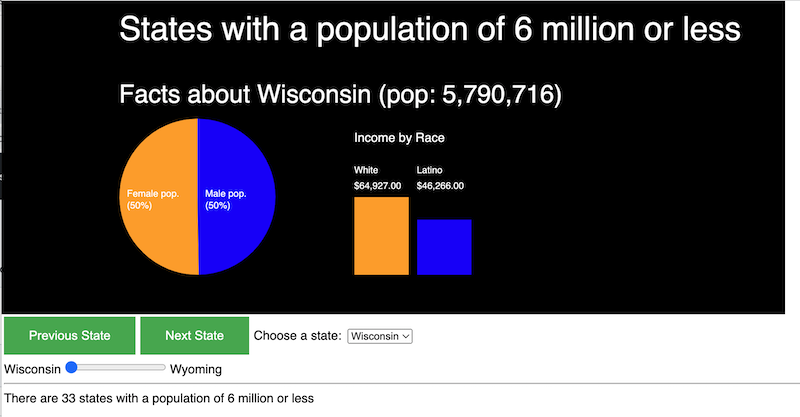

# PE-19 - Higher Order Functions

## Overview
You will be editing code of your work in progress to use higher-order functions to iterate over and filter arrays of state census data. Start with your PE18 (or HW5 code) to complete this exercise. 

## I. Get started

- Duplicate the sketch folder and rename it ***lastName-PE19-small-states***

## II. In the `readStates()` function in **sketch.js**

- After using a loop to create an array of `State` instances in `stateArray`, we will then use higher-order array method to create a new array that "filters out" some of the `State` instances.

#1 - Filter high-population states out of JSON data. Today we only want to analyze census data for states that have fewer people in them. Set `stateArray` equal the value returned from calling the `.filter()` array method of `stateArray` with a function expression. The function expression should return a boolean for whether the current state's population is smaller than 6,000,000 (true or false).

#2 - After filtering, print out to the console the reduced `.length` of `stateArray` - e.g. `"After filtering, there are XX states with a population less that 6,000,000"`

#3 - Then call `updateViz()` with the first state in the array (as you did before):

  - Make sure that you are displaying the population of the current state somewhere in your visualization
  - Also display the total number of states in the array somewhere

#4 - Make sure the functionality of your program is unhurt by these changes to the size of `stateArray`, for instance:

  - The "Previous State" and "Next State" buttons must still work (meaning that you CAN NOT hard-code the length of the array in the code - ex. `52` - but instead must use `stateArray.length-1` to access the last state in the array
  - If your UI is using a slider to choose the states, the maximum value of that slider can no longer be hard-coded:
    - Solution: create the UI *after* the data has loaded (then you can look at the `.length` of `stateArray`
  - For your pull down, you ARE allowed to hard-code in 5 low-population states

#5 - I will also be testing your code's functionality with population values of 10,000,000 and 25,000,000 - it should function normally

#6 - Make sure you comment your code with all change, and follow the coding standards for all code you create for this assignment

## III. Submission
- Zip your entire PE19 sketch folder and submit it to the PE19  dropbox.

## IV. Example

