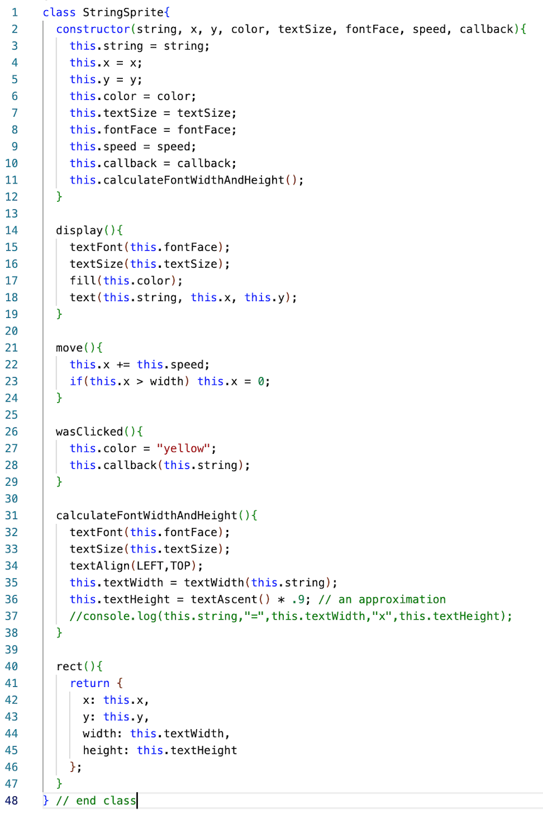

# Week 10 Notes

## I. String Formatting & Parsing Strings as Numbers
- See *String Formatting Parsing* PDF in myCourses

<hr>

## II. Array Destructure
- See *Array Spread and Destructure* PDF in myCourses

<hr>

## III. PE-14 String Theory
- Be sure to read the requirements, completely
- Two external text files
  - one with text/lyrics/essay etc
  - one with a table of data (that includes numbers) related to your text – amounts, currency, percentages, dates, weights, etc
    - ***here is an example of tabular data:***

```
Ford,Bronco,10
Honda,Odyssey,2
Jeep,Gladiator,11
Plymouth,PT Cruiser,6
Toyota,Rav4,3
```

- Create multiple layers of visualized text and data.
- Animate some text and/or data.
- Make some bits/types of text, and/or data, *mouse-interactive*

<hr>

## IV. PE-15 Array Spread & Destructure
- This builds on top of PE-14 
- You just need to add a little bit of code for Array Spread & Destructure
- Be sure to hand this in, for partial credit (even if you didn;t finish the array stuff)

<hr>

## V. In-class Demo - `StringSprite`

- Let's build a demo that has animated text that can respond to being clicked on
- Create a new VSCode project in a folder named **text-sprite-demo**
- Create **StringSprite.js**, type in the code below, and link to it from **index.html**
- In **sketch.js** we'll write code to utilize this class

**StringSprite.js**




<hr><hr>

| <-- Previous Unit | Home | Next Unit -->
| --- | --- | --- 
| [**Week 9 notes.md**](09.md)     |  [**IGME-102 Schedule**](../schedule.md) | Week 11 notes
