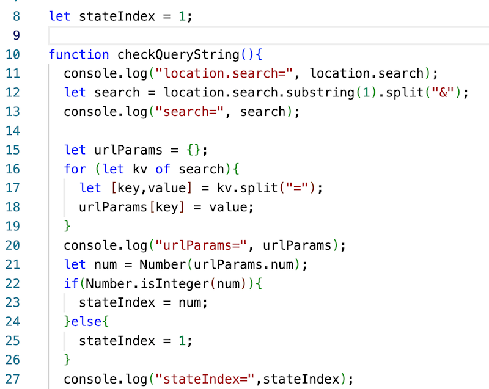

# Week 12 Notes

## Navigation

- [Monday Notes](#monday)
- [Wednesday Notes](#wednesday)
- [Friday Notes](#friday)

<a id="monday" />

## I. Monday

### I-A. Demo: Passing data in through Query String
- One way to pass data into your sketch is through the *query string*, which lloks like this:
  - `index.html?num=5&someothervalue=fred`
- Here's some code that can grab the `num` value and utilize it

- then you just need to utilize  `stateIndex` somewhere in your code

### I-B. User Control with HTML Form Elements
- More commonly, we want to give the user easy to use ways to modify our sketch!
- See *html DOM elements* PDF in myCourses
- See *DOM-elements-Demo* ZIP in myCourses
- Reference: https://p5js.org/reference/#group-DOM

### I-C. PE-18 - Adding controls to your Data Viz
- [PE-18](../docs/pe-18.md)

<a id="wednesday" />

## II. Wednesday

### II-A. Finish up PE-18
- Questions?

### II-B. HW-5
- See myCourses for PDF
  - Ignore any references in the PDF to "Project 2"
  - Ignore the "Map example" screenshot in the PDF, instead we will be building on PE-18
  - All of the requirements from the **Visualizing Your Data** and **Code Requirements** will apply
- The Data Source is the same Census file we used for PE-18
  - https://people.rit.edu/acjvks/shared/330/data/P2stateCensusData.json
- The "Data Dictionary" for the census file is still in myCourses week 11 
- The HW builds on PE-18:
  - You will still have all of the required controls to load in different states
  - In PE-18 you have already displayed 2 kinds of categorical data:
    - the male v. female breakdown as a pie chart
    - the 2 income categories as a bar graph
  - You must also display 2 other categorical data points:
    - for example a visualization of *race/ethicity of state population*
    - or *Health insurance coverage status and type by household income coverage by income*
    - or the *ratio of income to poverty level*
  - Use at least one new type of visualization beyond what we've already used (bar and pie chart) for these 2 new categorical points
    - ideas: https://datavizcatalogue.com/
    - a fairly easy to implement example would be a stacked bar graph
  - Add one more DOM control (for a total of 4) that the user can utilize to change the visualization
    - Examples: a checkbox, or radio buttons
  - All of the visualizations must be properly labeled so that it's easy for the user to figure them out
  - Use the appropriate string formatters (decimal, percentage, currency) as applicable 
  

<a id="friday" />

## I. Friday

- Work on HW-5!
- Plan for rest of semester:
  - Monday 13A (11/14) - start on prep for *HW-6 Sprite World*
  - Friday 13C (11/18) - Written Exam #2 (will have study sheet and sample questions on Monday 13A
  - Finals Week - Exam #3 (I am dropping lowest of 3 exam grades)

| <-- Previous Unit | Home | Next Unit -->
| --- | --- | --- 
| [**Week 11 notes.md**](11.md)     |  [**IGME-102 Schedule**](../schedule.md) | Week 13 notes
